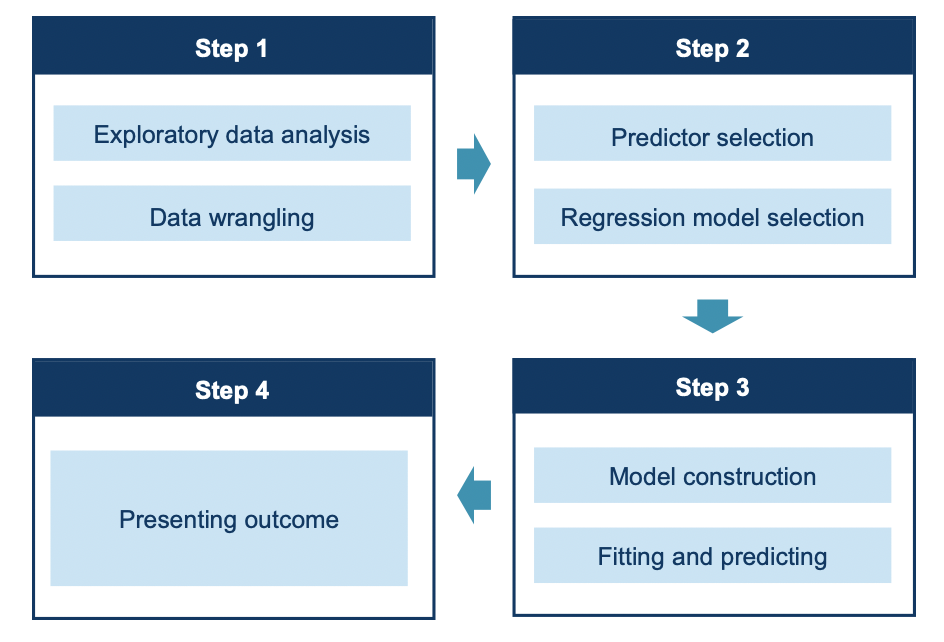

# DSCI_522_GROUP_311 Milestone Wine Quality Prediction
-------------
**Author**: Hanying Zhang, Tao Huang, Xugang Zhong

The milestone project is for the course DSCI522 Data Science Workflows from Master of Data Science program at the University of British Columbia. This repository includes data, scripts and other analysis-related files. The project predicts the wine quality based on data obtained from the [University of California Irvine Machine learning Repository](http://archive.ics.uci.edu/ml/datasets/Wine+Quality). 

## Introduction

According to [British Columbia Wine Institute](https://winebc.com/industry/media/quick-facts/), the BC wine industry contributes approximately $2.8 billion annually to British Columbia’s economy. To facilitate the development of BC wine industry, stakeholders are seeking a better way to improve the wine production and selling process with new techniques applied. Globally, wine certification and quality assessment are essential given this context. 

Wine quality assessment basically consists of two parts: lab test and sensory test. Physicochemical lab test generally characterize wine based on features such as density, pH value, acidity, sugar, and alcohol, etc. While the sensory test is mainly relying on qualified expert. Due to the low interpretation of human sense, the relationship between sensory test and the lab test is somehow compared to a black box. Therefore, the industry is curious about how ‘good’ the wine is, given the physicochemical lab test results. 

[Image courtesy of Getty](https://253qv1sx4ey389p9wtpp9sj0-wpengine.netdna-ssl.com/wp-content/uploads/2019/02/Wine_Cert_Programs_GettyImages_636693944_1920x1280.jpg)

## Proposal

### Research Question

The specific questions to be addressed are:

- **Given the Physicochemical lab test, how is the wine quality? (primary predictive question)**
- What feature most strongly predict whether a wine is good or not?
- What is the average pH value of wines rated as good?

### Data Description 

The dataset used in our milestone project is related to the Portuguese "Vinho Verde" wine. It was sourced from the UCI Machine Learning Repository and can be found [here]( http://archive.ics.uci.edu/ml/datasets/Wine+Quality). There are 1599 observations in the dataset. The 11 features from physicochemical lab tests and one response from sensory test are listed as below: 

**Input variables/features:**

- fixed acidity 
- volatile acidity 
- citric acid 
- residual sugar 
- chlorides 
- free sulfur dioxide 
- total sulfur dioxide 
- density 
- pH 
- sulphates 
- alcohol 

**Output variable/response:**

- quality (score between 0 and 10) 

### Analysis Plan

To answer the predictive question, regression model will be applied to predict the wine quality. As shown in the flow chart below, firstly, exploratory data analysis will be performed to find out the existance of data imbalance, and the distributions of features. In the second step, we will compare multiple regression models. In terms of the data splitting, we will split 20% of data as our test data before fit the regression model. To optimize our model, hyperparameter optimization will be implemented. 

### Research output

At the end of the project, a report including visualization, model-building procedures is expected. Metrics such as precision, and accuracy will also be included in our final report.

## Exploratory Data Analysis

The detailed exploratory data analysis can be found [here](https://github.com/UBC-MDS/DSCI_522_GROUP_311/blob/6580b870cce823647df756aa431ecc9a185b786e/src/wine_quality_eda.ipynb)。

## Dependencies

- Python 3.7.3 and Python packages:
  - docopt==0.6.2
  - requests==2.22.0
  - pandas==0.24.2
  - scikit-learn ==0.21

## Reference

P. Cortez, A. Cerdeira, F. Almeida, T. Matos and J. Reis. Modeling wine preferences by data mining from physicochemical properties. In Decision Support Systems, Elsevier, 47(4):547-553, 2009. 
