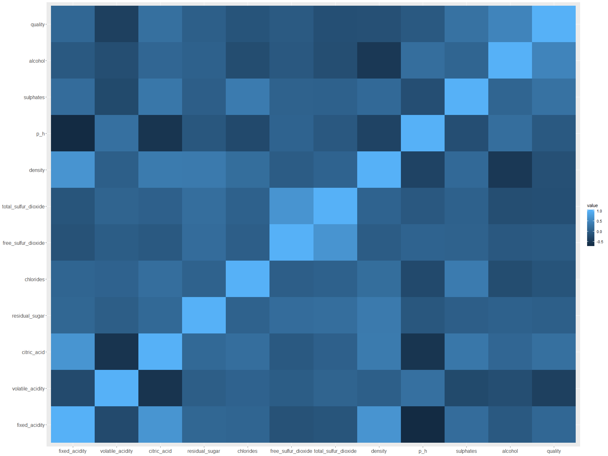

Exploratory data analysis of the Wine quality data set
================

## Summary of the data set

This dataset is about red variants of the Portuguese “Vinho Verde” wine.
For more details, consult the reference \[Cortez et al., 2009\]. It was
provided on
[Kaggle](https://www.kaggle.com/uciml/red-wine-quality-cortez-et-al-2009),
but it was originally sourced from the [UCI Machine Learning
Repository](https://archive.ics.uci.edu/ml/datasets/Wine+Quality).

Each row in the data set represents several metrics of a certain red
wine gained from its physicochemical tests such as acidity, sugar,
chlorides, sulfur dioxide and alcohol etc. The last column for each row
represents the quality score. A wine’s quality score is measured by
sensors, which is score from 0 to 10, with 0 being the lowest and 10
being the highest. We will build a model to discover the relationship
between the physicochemical measurements and quality score. There are
1599 observations in the data set, and 11 features. There are 0
observations with missing values in the data set.

## Partition the data set into training and test sets

We will split the data into the training set with 75% of observations
and test set with 25% of observations. Below are the counts of
observations for each class:

| Data partition | 0 | 1 | 2 | 3 |  4 |   5 |   6 |   7 |  8 | 9 |
| :------------- | -: | -: | -: | -: | -: | --: | --: | --: | -: | -: |
| Training set   | 0 | 0 | 0 | 8 | 43 | 545 | 511 | 160 | 15 | 0 |

Table 1. Counts of observation for each quality.

<!-- -->
 Figure 1. Distribution of training set targets(y).

The quality classes of red wines are very **imbalanced**, this is
definitely something we want to pay attention to. Most wines are among
the middle classes(5 to 7), very few wines than excellent(class 8) or
poor ones(class 3,4).

## Exploratory analysis on the training data set

### Distributions of all features

<!-- -->
Figure 2. Distribution of all features in the training set.

The histograms of all the features do not show any anomaly here.

### Correlation between features

<!-- --> Figure 3.
Correlation heatmap between features.

From the heatmap, I can see the following combinations of features are
positive related:

1.  `fixed_acidity` and `citric_acid`
2.  `fixed_acidity` and `density`
3.  `total_sulfur_dioxide` and `free_sulfur_dioxide`

For some chemical reasons, these three sets of features are highly
correlated, and we definitely need to be aware of this when building our
machine learning model.
